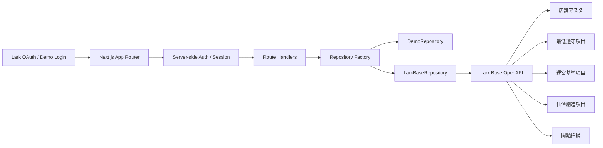

## 1. システム構成


## 2. 採用技術
- フロントエンド: `Next.js 16` + `React 19` + `TypeScript`
- UI: `Tailwind CSS 4`
- 状態管理: `Zustand`
- バリデーション: `Zod`
- グラフ: `Recharts`
- 認証: `Lark OAuth 2.0`
- データアクセス: Server-side `Route Handler` + `Repository` パターン

## 3. レイヤ構成
### 3.1 App レイヤ
- `src/app/`
- 役割: ルーティング、ページ、レイアウト、API Route

### 3.2 UI レイヤ
- `src/components/`
- 役割: 評価ウィザード、ステータス表示、チャート、是正ボード

### 3.3 ドメインレイヤ
- `src/lib/domain.ts`
- 役割: `Store`、`FiveCResult`、`OperationAudit`、`ValueAudit`、`RectificationTask` などの業務型定義

### 3.4 業務ルールレイヤ
- `src/lib/business-rules.ts`
- 役割: 採点計算、Gate 判定、グレード計算、期限判定

### 3.5 認証レイヤ
- `src/lib/auth/`
- 役割: Session Cookie、Lark OAuth、ロール解決

### 3.6 データアクセスレイヤ
- `src/lib/repositories/`
- `BaseRepository`: UI から見た共通インターフェース
- `DemoRepository`: mock データ専用
- `LarkBaseRepository`: Lark Base OpenAPI 用

## 4. 主要ルート
| ルート | 用途 |
|---|---|
| `/` | モード選択 / ログイン起点 |
| `/sv/dashboard` | SV ダッシュボード |
| `/sv/audits/new` | 5C 評価作成 |
| `/tasks` | 問題指摘 / 是正一覧 |
| `/store/my-5c` | 店舗向け結果確認画面 |
| `/dashboard` | 全店 Dashboard |
| `/dashboard/stores/[storeId]` | 店舗別 Dashboard |
| `/api/auth/demo` | Demo ログイン |
| `/api/auth/lark/login` | Lark OAuth 開始 |
| `/api/auth/lark/callback` | Lark OAuth コールバック |
| `/api/dashboard` | ダッシュボードデータ取得 |
| `/api/dashboard/overview` | 全店 Dashboard 集計 |
| `/api/dashboard/stores/[storeId]` | 店舗別 Dashboard 集計 |
| `/api/dashboard/issues/top` | 改善項目ランキング / 問題ドリルダウン |
| `/api/dashboard/rankings/top` | TOP10 |
| `/api/dashboard/rankings/worst` | WORST10 |
| `/api/dashboard/hygiene` | 花王衛生検査要改善店舗 |
| `/api/audits` | 評価送信 |
| `/api/tasks` | 是正タスク一覧取得 |
| `/api/tasks/[id]/feedback` | 店舗の是正報告 |
| `/api/tasks/[id]/resolve` | SV による是正完了確定 |
| `/api/schema` | Base スキーマ参照 |

## 5. 型設計
### 5.1 主要ドメイン
```ts
export type UserRole = "sv" | "store";
export type TaskCategory = "minimum" | "operation" | "value";

export interface FiveCResult {
  id: string;
  storeId: string;
  storeName: string;
  auditDate: string;
  cycle: "Q1" | "Q2" | "Q3" | "Q4";
  minimumScore: number;
  minimumGrade: string;
  operationScore: number;
  valueScore: number;
  totalScore: number;
  stage:
    | "minimum_in_progress"
    | "minimum_failed"
    | "minimum_passed"
    | "operation_in_progress"
    | "completed";
  createdBy: string;
  minimumAuditId: string;
  operationAuditId: string;
  valueAuditId?: string;
}

export interface RectificationTask {
  id: string;
  storeId: string;
  storeName: string;
  auditDate: string;
  category: TaskCategory;
  sourceItemKey: string;
  issueType: string;
  comment: string;
  improvementPlan: string;
  dueDate: string;
  assignee: string;
  svName: string;
  status: "open" | "submitted" | "resolved" | "overdue";
}
```

### 5.2 評価送信 payload
```ts
export interface CreateAuditInput {
  storeId: string;
  cycle: "Q1" | "Q2" | "Q3" | "Q4";
  auditDate: string;
  evaluator: string;
  minimumItems: AuditDraftItemInput[];
  operationItems: AuditDraftItemInput[];
  valueItems: AuditDraftItemInput[];
  minimumCompletionState: "draft" | "saved" | "completed" | "blocked";
  operationCompletionState: "draft" | "saved" | "completed" | "blocked";
  valueCompletionState: "draft" | "saved" | "completed" | "blocked";
  tasks: CreateTaskInput[];
}
```

## 6. Gate 制御の実装方針
### 6.1 UI レベル
- `AuditWizard` で最低遵守 22 項目を最初に表示する
- `minimumScore === 22` でのみ後続セクションを解放する
- 未通過時は `運営基準` / `価値創造` をロック表示する
- 未通過項目は `TaskDraftEditor` で `問題指摘` 草稿へ自動反映する

### 6.2 API レベル
- `/api/audits` は `minimumItems` を必須とする
- `minimumCompletionState` / `cycle` を必須とする
- `minimumPassed` が `false` の場合、後続評価は保存対象外または blocked 扱いにする

### 6.3 Repository レベル
- `DemoRepository` / `LarkBaseRepository` の両方で `canAdvanceAfterMinimum()` を使用する
- 本番モードでも Gate 判定は Web 側で必ず再検証する
- Base の formula 結果だけに依存せず、送信前データでも 22/22 判定を行う

## 7. Base マッピング
### 7.1 manifest
`src/config/production/base-schema-manifest.production.json` で本番用テーブル・主要フィールド名を定義する。

```json
{
  "appToken": "RADabvBDpavPzFsMmIHj7KOxpXc",
  "tables": {
    "stores": { "tableId": "tblPXXFwLGJh96Np" },
    "minimum": { "tableId": "tblVQA4TkDmBAImb" },
    "operation": { "tableId": "tbldp5mMzD6BRkuj" },
    "value": { "tableId": "tblq0BeYXTzhCqcs" },
    "issues": { "tableId": "tblatoQ7jqgteyQP" },
    "itemMaster": { "tableId": "tblQJcMuzwota38S" }
  }
}
```

### 7.2 チェックリスト設定
- `minimum-checklist.production.json`: 22 項目
- `operation-checklist.production.json`: 50 項目
- `value-checklist.production.json`: 20 項目

これらは field mapping を production 用に保持する。現状は `__UNRESOLVED_*__` を含むため、本番接続前に実フィールド ID / 名称へ置換する。

### 7.3 ビジネスオブジェクト対応
| Base | Web オブジェクト | 用途 |
|---|---|---|
| 店舗マスタ | `Store` | 店舗基本情報、SV 所属、最新結果の参照 |
| 最低遵守項目 | `OperationAudit` 相当 | 最低遵守の 22 項目結果 |
| 運営基準項目 | `OperationAudit` | 運営基準 50 項目結果 |
| 価値創造項目 | `ValueAudit` | 価値創造 20 項目結果 |
| 問題指摘 | `RectificationTask` | 是正依頼、期限、写真、コメント |

## 8. 読み書きフロー
### 8.1 読み取り
- SV: `店舗マスタ` から担当店舗を解決し、該当店舗に紐づく評価と問題指摘のみ返す
- 店舗: `店舗ユーザーID` とログインユーザーを対応付け、自店舗データのみ返す
- `getRecentResults()` は最低遵守 / 運営基準 / 価値創造を店舗単位で統合して `FiveCResult` を作る

### 8.2 書き込み
- 最低遵守は必ず `最低遵守項目` へ書き込む
- `minimumPassed === true` の場合のみ `運営基準項目` と `価値創造項目` を書き込む
- NG / 未通過項目は `問題指摘` へ書き込む
- 店舗の是正報告は `問題指摘` 更新で保持する

## 9. Dashboard 集計方針
### 9.1 全店 Dashboard
- `Store` + `FiveCResult` + `RectificationTask` をサービス層で集計する
- KPI は server-side で計算し、フロントへ図表用 JSON を返す
- 最低遵守未通過理由は `minimumAudit.items` の `NG` 項目を集計する
- 評価 TOP / WORST は `今回 5C 点数合計` 相当値で並べる
- 上位改善項目は `問題指摘.issueType` を集計する
- フォーマット別推移は `前回` / `今回` の平均値を算出する
- 花王衛生検査は `hygiene` テーブル設定がある場合は独立表を優先し、未設定時のみ `店舗マスタ` の fallback フィールドを使う

### 9.2 店舗別 Dashboard
- 店舗詳細は `currentResult` / `previousResult` / `minimumAudit` / `operationAudit` / `valueAudit` / `tasks` を合成する
- 最低遵守 Gate は `minimumScore === 22` で判定する
- 店舗画面では 22 / 50 / 20 の各項目 OK / NG を可視化する
- 問題指摘一覧は `open / overdue / resolved` に分けて表示する

## 10. 権限戦略
- フロントエンドは Base OpenAPI を直接呼ばない
- 本番モードではすべて server-side request に限定する
- `user_access_token` は HttpOnly Cookie 経由で server-side のみ利用する
- `店舗マスタ` の `SVユーザーID` / `店舗ユーザーID` を認可解決のキーにする
- Base 側権限だけで足りない場合でも、API レイヤで返却範囲を再度絞る

## 11. Demo / 本番分離
### 10.1 Demo
- 脱敏済み seed データを使用
- 書き込みはメモリ上の mock DB に限定
- 実 Base 接続なし

### 10.2 本番
- Lark OAuth 認証後、`LarkBaseRepository` を使用
- `BaseRepository` インターフェースにより UI を共通化
- mapping 未解決時は `assertProductionChecklistResolved()` で起動時に検知する

## 12. 環境変数
- `LARK_APP_ID`
- `LARK_APP_SECRET`
- `LARK_REDIRECT_URI`
- `LARK_BASE_APP_TOKEN`
- `LARK_BASE_STORE_TABLE_ID`
- `LARK_BASE_MINIMUM_TABLE_ID`
- `LARK_BASE_OPERATION_TABLE_ID`
- `LARK_BASE_VALUE_TABLE_ID`
- `LARK_BASE_ISSUE_TABLE_ID`
- `LARK_BASE_ITEM_MASTER_TABLE_ID`
- `LARK_STORE_OWNER_FIELD_ID`
- `LARK_SV_OWNER_FIELD_ID`
- `NEXT_PUBLIC_APP_TITLE`

## 13. 本番接続前の残タスク
- 22 / 50 / 20 各 checklist JSON の実 field mapping を埋める
- `問題指摘` の status / feedback 系フィールド名を実 schema に合わせて最終確定する
- 写真アップロードを実 attachment token フローへ接続する
